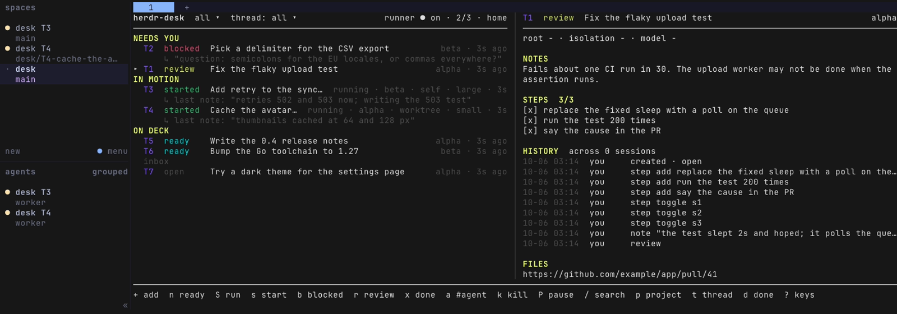

# herdr-desk

<p align="center"><strong>A task board for you and your agents, with a coordinator, a runner, and a session journal.</strong></p>

<p align="center">
  <a href="LICENSE"></a>
  <a href=".github/workflows/ci.yml"></a>
  <a href=".github/workflows/release.yml"></a>
  <a href="https://github.com/herdrdev/herdr"></a>
</p>

<p align="center"></p>

herdr-desk is a task board for people who work with coding agents in [herdr](https://github.com/herdrdev/herdr).
A coordinator agent turns what you ask for into tasks and runs, a runner starts an agent on a task in its own
herdr workspace and hands the task back to you, and a journal gives every agent session a memory. It is one
static binary with a CLI and a board; without herdr you keep the board, the CLI, and the journal.

Status: pre-release, under construction. This version has the store, the CLI, the journal, the
coordinator and the runner, the board, and the packaging.

## Install

herdr-desk is one static binary, `herdr-desk`, for macOS and Linux. The herdr plugin needs herdr 0.9.0 or
later, and Go to build the binary when no release matches your platform. Pick the line that fits.

### With herdr

```sh
herdr plugin install federbenjamin/herdr-desk
```

That is the whole install. After herdr shows its preview and you confirm, its build step
(`scripts/fetch-or-build.sh`) does the rest, with a line in its report (below) for each thing it wrote or
skipped:

- **The binary.** It downloads the release for your platform, checks its SHA-256 against `checksums.txt`,
  and builds from source with Go when no release matches. When no `herdr-desk` is on your PATH it copies
  the binary to `~/.local/bin/herdr-desk`. A later install replaces that copy and tells you to run
  `herdr-desk ticker stop`; herdr's next start runs the new ticker. A `herdr-desk` from anywhere else
  (Homebrew, `go install`) is left alone.
- **`herdr-desk setup`.** It writes `~/.config/herdr-desk/config.toml` (0600; values already there are kept)
  and the scratch root. In herdr's `config.toml` it binds `prefix+t` (open the board) and `prefix+a`
  (capture) where they are free and adds herdr-desk's sidebar row (see
  [The sidebar row](docs/runner.md#the-sidebar-row)), each in one marked block, copying the file to
  `config.toml.herdr-desk-bak-<time>` first. When herdr has no `config.toml` yet, it creates one holding only
  those two blocks; when it cannot find herdr either, it writes nothing there, says why, and says to run
  `herdr-desk setup` once herdr is found. It never binds `ctrl+d`.
- **Claude Code.** When `claude` is on your PATH, setup uses the `claude-code` profile, which fills `[agent]`
  so runs and the coordinator start Claude Code, and the step installs the Claude Code plugin
  (`claude plugin marketplace add federbenjamin/herdr-desk`, then `claude plugin install herdr-desk@herdr-desk`).
  With no `claude`, it says so and points to [herdr with another agent](#herdr-with-another-agent).

herdr shows a build step's output only when the step fails, and a step that did not finish does not fail
the install, so the build step also writes its report to `~/.local/state/herdr-desk/install.log`
(`$XDG_STATE_HOME/herdr-desk/install.log` when that is set); each install replaces it. A step that did not
finish is reported there with its reason. Once the cause is fixed, `herdr-desk setup` re-runs setup (add
`--profile claude-code` for Claude Code), and `claude plugin marketplace add federbenjamin/herdr-desk`, then
`claude plugin install herdr-desk@herdr-desk`, re-runs the Claude Code plugin step. `herdr-desk setup --force`
replaces another program's binding of `prefix+t` or `prefix+a`. The board's popup is a second entry, the
action `open-popup`, and has no default key.

To undo the install: `claude plugin uninstall herdr-desk@herdr-desk`, `herdr plugin uninstall herdr-desk`, then
delete the two `herdr-desk` blocks from herdr's `config.toml` or put its `config.toml.herdr-desk-bak-<time>`
back.

The Claude Code plugin registers a `SessionStart` hook (`herdr-desk hook start --format claude-code`) and the
`herdr-desk` skill. Optional, and only on a machine where `claude` was not on your PATH at install: inside
Claude Code, run `/plugin marketplace add federbenjamin/herdr-desk`, then `/plugin install herdr-desk@herdr-desk`.
`herdr-desk setup` also writes the skill to `~/.claude/skills/herdr-desk/SKILL.md` when you pass
`--skill-dir ~/.claude/skills`.

Claude Code keeps a plugin by its version. A release changes the version, so `claude plugin update
herdr-desk@herdr-desk` picks up the new skill. A build from source between releases keeps the version, so
`claude plugin update` says it is already at the latest and keeps the old skill: remove the plugin and
install it again with `claude plugin uninstall herdr-desk@herdr-desk`, then
`claude plugin install herdr-desk@herdr-desk`.

**Trust each root once.** `claude` asks "Is this a project you created or one you trust?" the first time
it starts in a folder it has not trusted, and herdr shows that pane as `blocked` with no session.
herdr-desk never answers that question: trusting a folder is your choice. A worktree of a trusted repo is
trusted, so the cost is one `claude` start per root, once: start `claude` in each root you list (see
`herdr-desk roots`) and in the scratch root (`$XDG_DATA_HOME/herdr-desk/scratch`, where the coordinator
also runs), and answer the question there. Until you do, a run in a root `claude` does not trust sets its
task `blocked` with a note naming the pane.

### herdr with another agent

Install the plugin as above. With no `claude` on your PATH, the install runs `herdr-desk setup` with no
profile and its report (`install.log`, above) points here. The profile is what teaches herdr-desk to start
your agent, so set the `[agent]` values in `~/.config/herdr-desk/config.toml` yourself (with `claude` on
your PATH the install filled them for Claude Code; replace them):

```toml
[agent]
worker = ["my-agent", "--model", "{model}", "--session-id", "{session}", "--", "{message}"]
coordinator = ["my-agent", "--session-id", "{session}", "--system-prompt", "{prompt}"]
session_env = "MY_AGENT_SESSION_ID"   # the variable your agent sets to its session id
models = ["small", "large"]           # the models a run may use; the worker's {model}
```

Templates are argv arrays; herdr-desk never passes task text through a shell. `{prompt}` is the
coordinator skill's text (`herdr-desk skill coordinator` prints it). `session_env` is how herdr-desk
tells an agent's commands from yours: a caller with a session id is an agent. Only the
`claude-code` profile is tested.

### No herdr

```sh
go install github.com/federbenjamin/herdr-desk/cmd/herdr-desk@latest
```

`herdr-desk add -t "first task"` and the board (`herdr-desk`) work at once, and
`herdr-desk setup --profile claude-code --skill-dir ~/.claude/skills` is the optional profile and skill step.
Every command works with no ticker running; only the timed jobs wait (see
[Running the ticker](docs/ticker.md)). Runs and the coordinator need herdr.

## Features

- **Tasks.** `herdr-desk add`, `list`, `show`, `set`, `edit`, `steps`. Statuses are `open`, `ready`,
  `started`, `blocked`, `review`, and `done`. `ready` means approved, not started: a person sets it,
  and a run starts only when someone calls `herdr-desk run start`. Agents may propose tasks and set
  `review`, `blocked`, or `done`; they set `ready` only when `[coordinator] start_runs` is `auto`. An agent
  session other than the coordinator starts a run only in a root with `agents_may_start = true`.
- **A board.** Bare `herdr-desk` on a terminal is the board, in a herdr pane, a herdr popup, or any
  terminal. It shows what needs you, what is in motion, and what is on deck, and each live run's state.
  See [The board](docs/board.md).
- **A journal.** `herdr-desk note` and `herdr-desk decide` record facts from a session. `herdr-desk session <id> --md`
  renders the session's Work log, Todo, and Decisions, hiding what a merge or a compaction made
  stale. A Claude Code hook prints the view's path at the start of every session.
- **A coordinator.** `herdr-desk coordinator` opens one agent session per desk in its own herdr
  workspace. It talks with you, creates tasks, and starts runs by calling the binary. It never does the
  work. See [The coordinator](docs/coordinator.md).
- **Runs.** `herdr-desk run start T12` starts an agent on a task in a herdr workspace. herdr's own pane
  events track it and hand the task back to you. See [The runner](docs/runner.md).
- **One home per desk.** One machine owns the SQLite store. Every command on it opens the store, runs,
  and closes it; no background service, socket, listener, or token is involved. Every other machine is a client and
  sends its requests to the home over ssh.

## Usage

```sh
herdr-desk add -t "Add retry to the sync job"   # prints T1
herdr-desk                                      # the board; q quits
herdr-desk setup --runner on                    # once: let runs start (needs herdr)
herdr-desk run start T1                         # start an agent on T1
herdr-desk note "the sync job retries 3 times"  # record a fact in this session's journal
```

In herdr, `herdr-desk setup` binds these keys where they are free, and creates herdr's `config.toml` when herdr
has none:

| key | does |
|---|---|
| `prefix+t` | open the board in a split pane (the action `open-board`) |
| `prefix+a` | add a task from one line in a popup (the action `capture`) |
| none | open the board in a popup (the action `open-popup`) |

Every command, its flags, the exit codes, and the refusal codes are in [docs/commands.md](docs/commands.md).
The board's keys and layout are in [docs/board.md](docs/board.md).

## Configuration

The config is `~/.config/herdr-desk/config.toml` (under `$XDG_CONFIG_HOME` when set); every key, where state
lives, and the keys removed in earlier versions are in [docs/configuration.md](docs/configuration.md).

## How it works

- **Home and clients.** One machine, the home, owns the store; a second machine sends each request to it
  over ssh and shows a snapshot when the home does not answer. See [Home and clients](docs/home-and-clients.md).
- **The coordinator.** An ordinary agent session in its own herdr workspace that turns your requests into
  tasks and runs; it never does the work. See [The coordinator](docs/coordinator.md).
- **The runner.** One run per task, in a root, with an isolation and a model; herdr's pane events track it
  and hand the task back. See [The runner](docs/runner.md).
- **The ticker.** One process per home that does the timed jobs once a minute; herdr starts it, and without
  herdr you run it yourself. See [Running the ticker](docs/ticker.md).

## Contributing

Report a problem or ask a question in [GitHub Issues](https://github.com/federbenjamin/herdr-desk/issues).
Pull requests are welcome: see [CONTRIBUTING.md](https://github.com/federbenjamin/.github/blob/main/CONTRIBUTING.md),
and report a security issue as [SECURITY.md](https://github.com/federbenjamin/.github/blob/main/SECURITY.md) says.

```sh
sh scripts/checks.sh               # vet, the coverage gate, gofmt, shellcheck; --no-coverage runs go test instead
bash scripts/e2e/h01-add-list.sh   # the hand-test claims, one script each
```

`goreleaser` builds darwin and linux for arm64 and amd64 and publishes the archives
`herdr-desk_<version>_<os>_<arch>.tar.gz` with `checksums.txt` and the Homebrew cask. A `v*` tag runs
it in CI. Locally: `go run github.com/goreleaser/goreleaser/v2@latest release --snapshot --clean --skip=publish`.

## License

MIT © Benjamin Feder. See [LICENSE](LICENSE); third-party terms are in [THIRD_PARTY_NOTICES.md](THIRD_PARTY_NOTICES.md).
